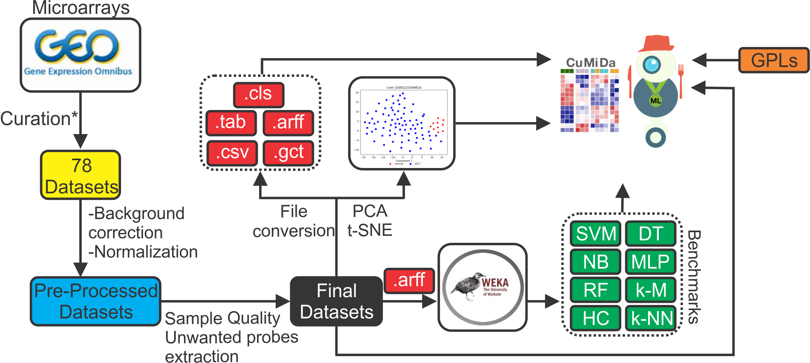
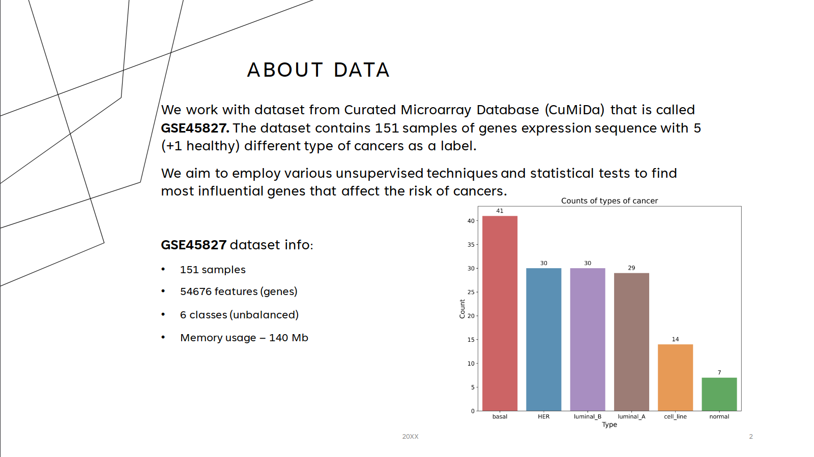
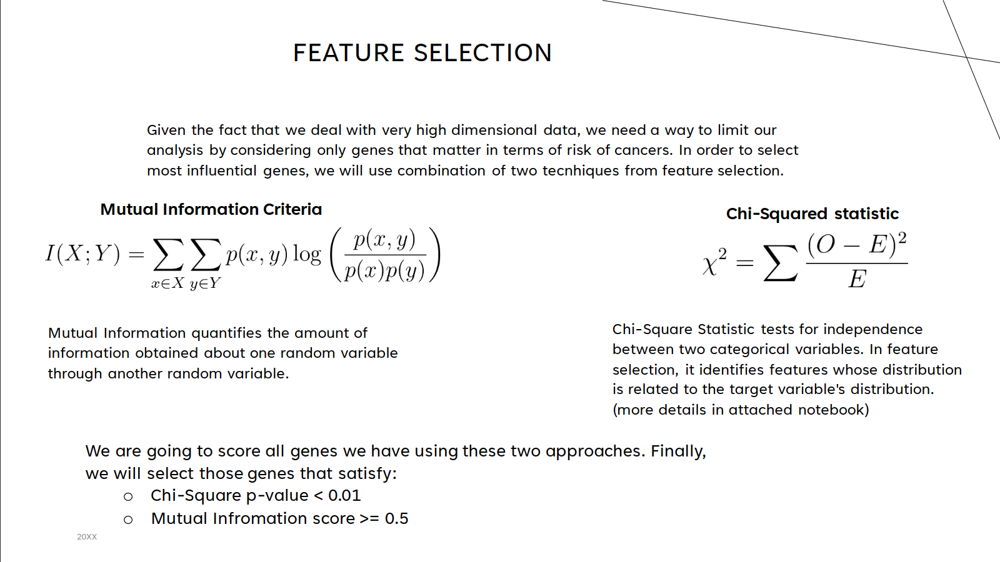
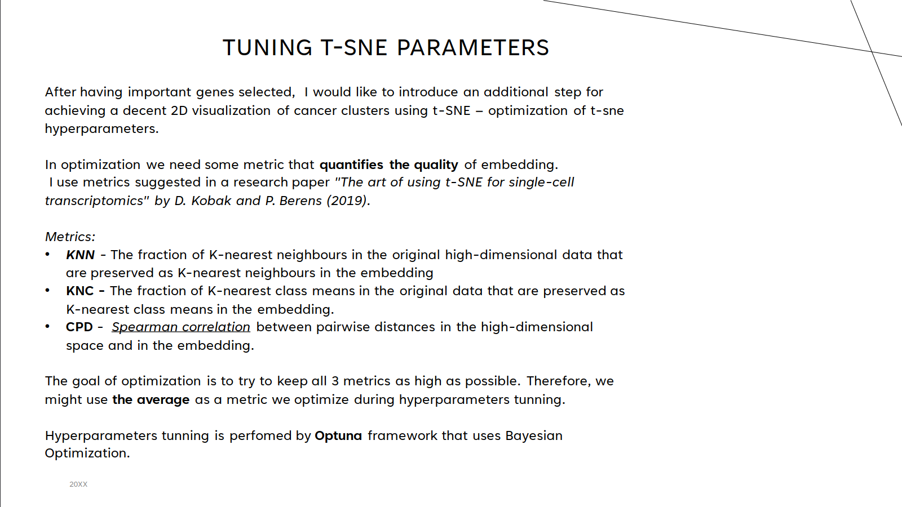
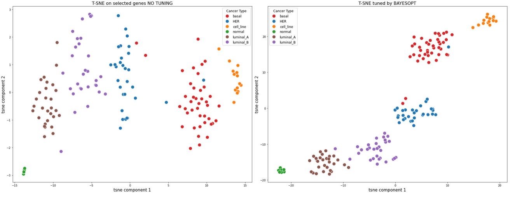
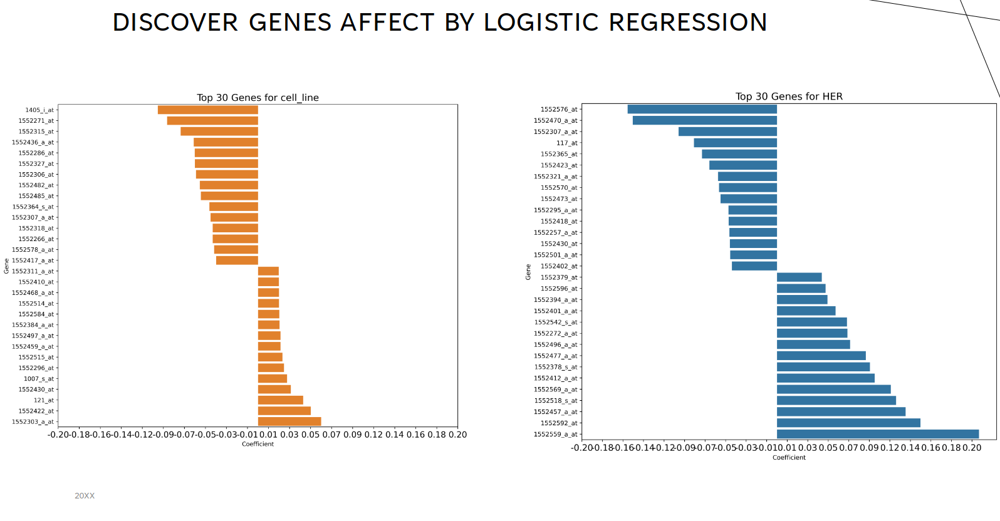

# Genes expression analysis with Unsupervised Learning
This is the final project for **DTSA5510**: Unsupervised ML class in CU Boulder.

We will work with dataset **GSE45827** on breast cancer gene expression from *CuMiDa* that contains 151 samples of genes expressions using microarray technology.

[link to dataset on Kaggle](https://www.kaggle.com/datasets/brunogrisci/breast-cancer-gene-expression-cumida)

## About project
Our project aims to delve into high-dimensional genetic data to extract critical insights regarding the genes that have the most significant impact on various cancer types. By leveraging advanced bioinformatics techniques, we seek to identify a set of genes that are most informative for the diagnosis and prediction of each type of cancer. To achieve this, we will employ a multifaceted approach that combines dimensionality reduction techniques and feature selection methods to manage and interpret the vast array of genetic information effectively.

## Data Description

A key component of our strategy involves the use of Bayesian optimization to enhance the performance of t-SNE (t-Distributed Stochastic Neighbor Embedding), a powerful dimensionality reduction technique. This optimization will enable us to refine our data visualization and ensure that the most relevant genetic features are highlighted. Additionally, we will apply statistical tests and mutual information criteria to meticulously select the most insightful genes for our analysis. These methods will allow us to filter through the extensive number of genes, focusing our attention on those that offer the greatest value for understanding and predicting cancer.

### Genes Selection

### tunning t-SNE projection

## Results
After selecting important genes using **Mutual Information** and **Chi-Square**, we ended up with a small set of 240 most influential genes. (Initially, we had 55 000 genes to choose from).
We used selected subset of genes for visualizing the high-dimensional structure of clusters and their relations to each other. *t-SNE* dimensionality reduction algorithm was used  for visualizing selected genes.
Hyperparameters of **t-SNE** were optimized in way that preserves both **macroscopic and microscopic structure** as much as possible.

  

## Affects of different genes on cancers

